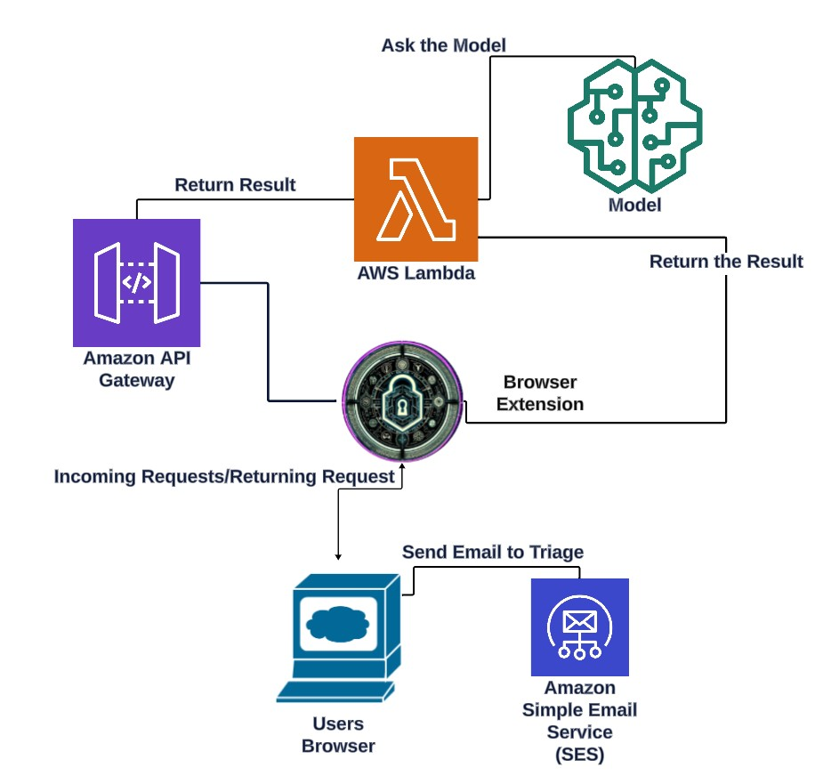

### Malverticus Web Extension Browser

Introduction
Malverticus is a powerful Chrome extension designed to enhance browser security by actively blocking malvertisements and malicious URLs. It uses advanced web request listeners in accordance with Chrome's Manifest V2 to provide a secure browsing experience.

### Features
+ Real-time URL Analysis: Classifies URLs as malicious or benign on-the-fly.
+ Dynamic Blocking: Intelligently blocks harmful web content before it reaches the user.
+ User-Friendly Interface: Offers clear notifications and easy control options.
## Architecture Diagram

## Technologies Used
Malverticus combines several cutting-edge technologies to provide robust and efficient functionality:

### Python & Jupyter
+ Exploratory Data Analysis (EDA): Utilizes Python in a Jupyter Notebook environment for analyzing data and experimenting with classification models.
+ Libraries and Integration: Employs libraries like Pandas, NumPy, Matplotlib, and Seaborn for data manipulation and visualization, integrated with Pytorch and AWS for enhanced cloud capabilities.
## Amazon Web Services (AWS)
+ AWS Lambda: Enables serverless computing, allowing code execution without managing servers, integrated with AWS SageMaker for event-driven applications.
+ AWS API Gateway: Manages and monitors APIs at scale, facilitating interaction with AWS Lambda functions and AWS CloudWatch for activity monitoring.
+ SageMaker: A comprehensive service for building, training, and deploying machine learning models, seamlessly integrated with Jupyter for model training.
### JavaScript
+ Interactive Web Pages: Utilizes JavaScript alongside HTML and CSS to build interactive user interfaces for real-time web request handling.
+ Google Chrome Libraries: Connects with Chrome's extensive libraries to listen and respond to browser requests efficiently.

# Follow setup instructions
### Usage
After installation, the extension can be loaded into Chrome through the extensions page by enabling Developer Mode and loading the unpacked extension.
### Installation
Follow these steps to install the Malverticus Web Extension Browser:

| Step | Action | Command |
|------|--------|---------|
| 1    | Clone the repository. | `git clone https://github.com/yourgithub/malverticus-web-extension.git` |
| 2    | Change directory. | `cd malverticus-web-extension` |
| 3    | Install dependencies. | `npm install` *(if using Node.js dependencies)* |
| 4    | Create Model | Use the Model Creation .ipynb file on AWS SageMaker and Deploy model |
| 5    | Create Lambda | Create an AWS Lambda Function and use this code. Change the WHOIS API keys to your own |
| 6    | Load unpacked extension | Load Browser extension by unpacking extension in Developer mode at chrome://extensions |

*Note: Replace `npm install` with the appropriate command if your project uses a different technology or no additional dependencies are needed.*
*Note: Personal AllowLists.txt and BlockList.txt are required, These can be found by using Alexa top 100K urls or any source of Benign & Malicious URLS datalist.

### Contributing
Contributions to Malverticus are welcome! Please fork the repository and submit a pull request with your changes. For major changes, please open an issue first to discuss what you would like to change.

License
Distributed under the MIT License. See LICENSE for more information.
